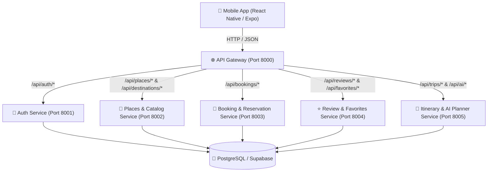

# 🏛️ Lankora Microservices Architecture

Scalable, domain-driven microservices architecture powering the **Lankora Sri Lankan Tourism Platform**.

---

## 📐 Architecture Overview



---

## 🔌 Service Port Allocation

| Service | Port | Description | Health Endpoint |
|---|---|---|---|
| **API Gateway** | `8000` | Central entrypoint, routing, CORS, aggregated health | `http://localhost:8000/api/health` |
| **Auth Service** | `8001` | User registration, login, profiles & preferences | `http://localhost:8001/health` |
| **Places Service** | `8002` | Destinations, heritage places, activities, stays & dining | `http://localhost:8002/health` |
| **Booking Service** | `8003` | Reservations for stays, tours, experiences & dining | `http://localhost:8003/health` |
| **Review Service** | `8004` | Star ratings, user reviews & bookmarking favorites | `http://localhost:8004/health` |
| **Itinerary Service** | `8005` | Trips, schedules & AI multi-day itinerary generation | `http://localhost:8005/health` |

---

## 🚀 Quick Start

### Option 1: Run with Docker Compose (Recommended)
From the `microservices/` directory:
```bash
docker compose up --build
```
This builds and starts all 5 microservices plus the API Gateway inside an isolated network.

### Option 2: Run Locally with Node.js
If Docker is not installed on your system:
```bash
cd microservices
npm run install:all
npm run dev
```
All microservices will spin up concurrently with live color-coded console logs.

---

## 🗄️ Domain-Isolated Database Schemas

The database schema is organized into modular domain files located in `supabase/schemas/`:
1. `01_auth.sql`: User profiles, travel preferences, and auto-profile trigger on signup.
2. `02_places_catalog.sql`: Destinations, places, experiences, dining, stays, and indexes.
3. `03_bookings.sql`: Bookings, reservations, payment status, and user policies.
4. `04_reviews.sql`: Star ratings, reviews, and user favorites.
5. `05_itineraries.sql`: Multi-day trips and individual itinerary items.

A unified master script is maintained at `supabase/schema.sql`.

---

## 📡 API Gateway Endpoint Catalog

### 1. Central Gateway
- `GET /` — Gateway status and route directory
- `GET /api/health` — Real-time health check pinging all 5 microservices

### 2. Auth Service (`/api/auth`)
- `POST /api/auth/register` — Register new user
- `POST /api/auth/login` — Sign in with email and password
- `GET /api/auth/profile/:id` — Get profile by ID
- `PUT /api/auth/profile/:id` — Update name, bio, avatar
- `PUT /api/auth/profile/:id/preferences` — Update travel style and dietary preferences

### 3. Places & Catalog Service
- `GET /api/destinations` — List destinations (supports `?category=`, `?featured=true`, `?search=`)
- `GET /api/destinations/:idOrSlug` — Get single destination by UUID or slug
- `GET /api/places` — List places (supports `?destination_id=`, `?category=`)
- `GET /api/experiences` — List tours, safaris, and activities
- `GET /api/restaurants` — Authentic eateries and tea lounges
- `GET /api/stays` — Eco-lodges, colonial villas, and beach resorts

### 4. Booking Service (`/api/bookings`)
- `GET /api/bookings?user_id=:id` — Get all bookings for a user
- `GET /api/bookings/:id` — Get booking details
- `POST /api/bookings` — Create a reservation for stay, tour, or restaurant
- `PATCH /api/bookings/:id` — Update booking status or notes
- `DELETE /api/bookings/:id` — Cancel a booking

### 5. Review Service (`/api/reviews` & `/api/favorites`)
- `GET /api/reviews?target_type=:type&target_id=:id` — Get reviews
- `POST /api/reviews` — Submit a review and rating
- `GET /api/favorites?user_id=:id` — Get user's saved places
- `POST /api/favorites` — Save a place/stay to favorites
- `DELETE /api/favorites` — Remove from favorites

### 6. Itinerary Service (`/api/trips` & `/api/ai`)
- `GET /api/trips?user_id=:id` — Get user trips
- `GET /api/trips/:id` — Get trip details with day-by-day items
- `POST /api/trips` — Create a new trip
- `POST /api/trips/:id/items` — Add an item to trip schedule
- `POST /api/ai/generate-itinerary` — AI generates a personalized Sri Lankan travel itinerary based on days, style, pace, and dietary preferences
